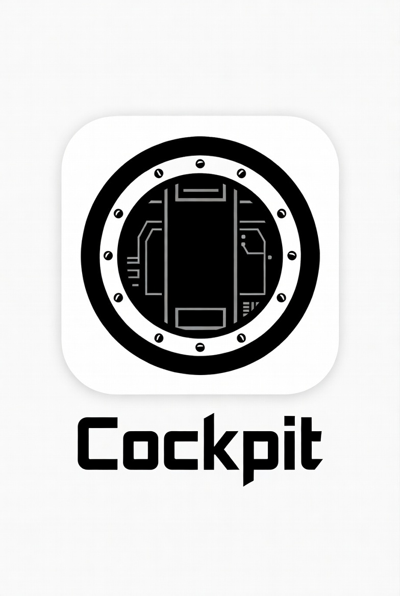
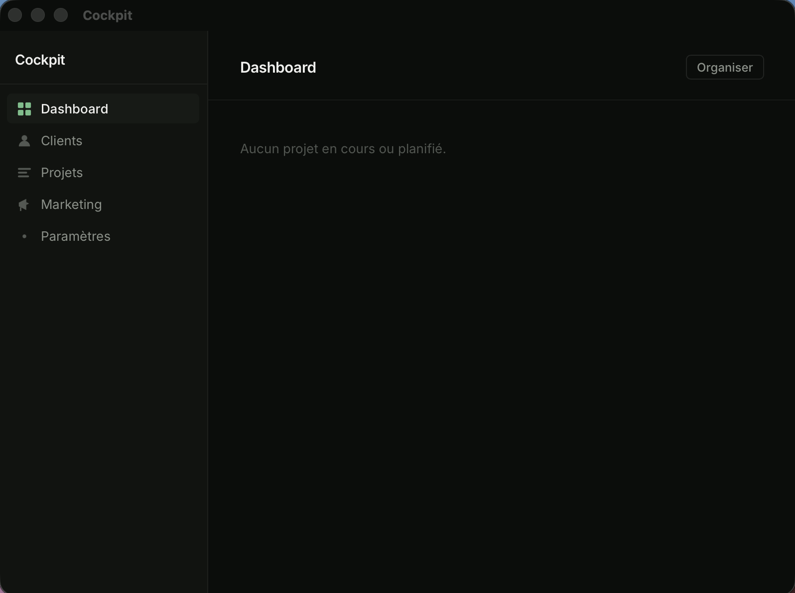
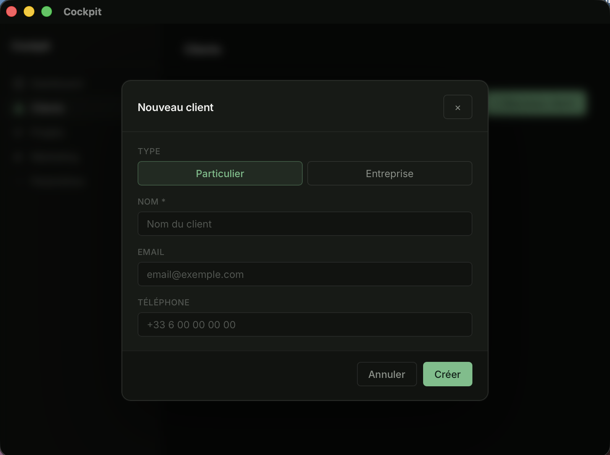
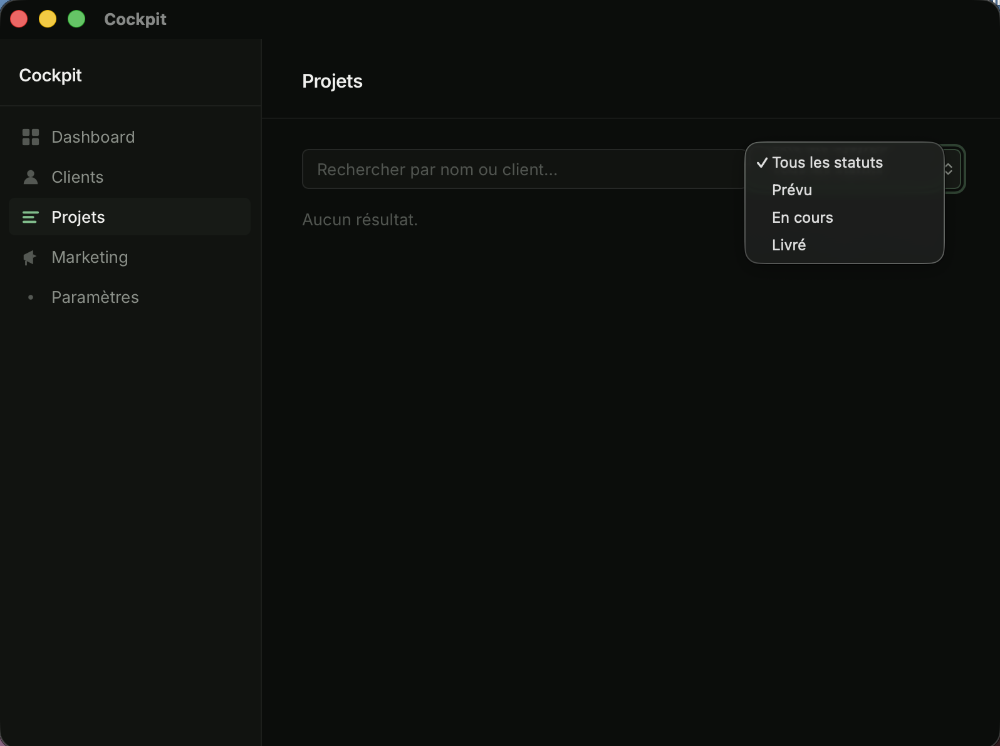
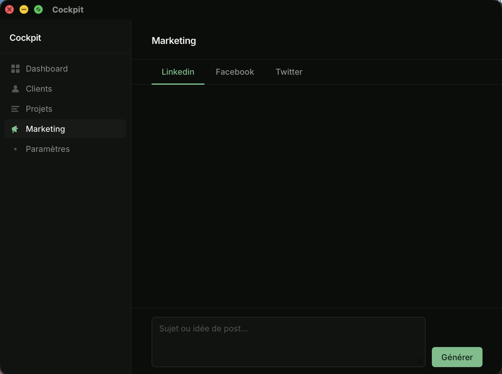
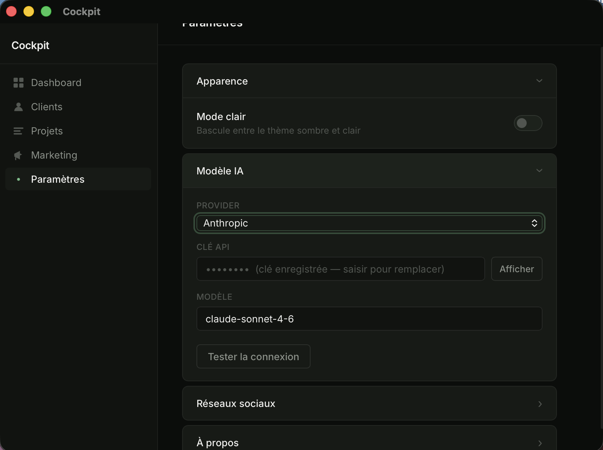

<div align="center">



# Cockpit

**Ton tableau de bord opérationnel. Self-hosted, rapide, sans abonnement.**

*Une application desktop native qui centralise clients, projets, marketing et IA — en un seul endroit.*

<br/>

[](https://v2.tauri.app/)
[](https://www.rust-lang.org/)
[](https://www.sqlite.org/)
[](./LICENSE)

</div>

---

## Le principe

Les outils SaaS pour freelances et consultants sont nombreux — mais ils t'imposent leur interface, leurs prix et leurs serveurs.

**Cockpit** tourne localement sur ta machine. Tes données restent dans un fichier SQLite sur ton disque. Pas d'abonnement, pas de sync cloud, pas de tracking.

```
Clients → Projets → Pipeline → Marketing IA → tout au même endroit
```

---

## Aperçu

<div align="center">

| Dashboard | Gestion des clients |
|:---------:|:-------------------:|
|  |  |

| Archive projets | Marketing IA |
|:---------------:|:------------:|
|  |  |

| Paramètres |
|:----------:|
|  |

</div>

---

## Fonctionnalités

- **Dashboard** — vue synthétique des projets actifs et planifiés, avec statuts, catégories et épingles
- **Clients** — fiches détail, édition inline, suivi des projets associés
- **Projets** — archive filtrée par nom / statut, création directe avec sélection du client, historique de build (contenu, actions, défis)
- **Marketing IA** — génération de posts LinkedIn / Facebook / Twitter via LLM, streaming en temps réel, édition et copie en un clic
- **Paramètres** — thème clair / sombre, provider LLM (Anthropic ou Ollama), prompts personnalisables par réseau social

---

## Stack

| Couche | Technologie |
|--------|-------------|
| Backend | Rust + [Tauri v2](https://v2.tauri.app/) |
| Persistance | SQLite via `rusqlite` (bundled — aucune dépendance système) |
| Frontend | HTML / CSS / JS vanilla — aucun bundler, aucun framework |
| Génération IA | Claude (streaming SSE) ou Ollama en local |

---

## Installation

> Cockpit n'est pas encore distribué en binaire précompilé. Il se build depuis les sources.

### Prérequis

- [Rust](https://rustup.rs/) ≥ 1.77.2
- [Tauri CLI](https://v2.tauri.app/start/prerequisites/) — `cargo install tauri-cli`
- Dépendances système Tauri (WebKit2GTK sur Linux, Xcode CLT sur macOS)

### Build

```bash
# Cloner le dépôt
git clone https://github.com/ton-pseudo/cockpit.git
cd cockpit

# Lancer en mode dev (interface graphique requise)
cargo tauri dev

# Ou compiler un binaire natif
cargo tauri build
```

Le binaire et l'installateur sont générés dans `src-tauri/target/release/bundle/`.

---

## Configuration

Au premier lancement, Cockpit crée automatiquement sa base de données dans le dossier standard de l'OS :

| Système | Chemin |
|---------|--------|
| macOS | `~/Library/Application Support/dev.cockpit.app/cockpit.db` |
| Linux | `~/.local/share/dev.cockpit.app/cockpit.db` |

La clé API LLM se configure depuis **Paramètres → Modèle IA**. Elle est stockée localement dans SQLite et n'est jamais exposée en clair vers l'interface.

---

## Confidentialité

Toutes tes données restent sur ta machine. Aucun serveur intermédiaire, aucune télémétrie. Les appels LLM transitent directement entre Cockpit et le provider que tu as configuré.

---

## Développement

```bash
# Vérifier que le code Rust compile sans erreur
cargo check                  # depuis src-tauri/

# Mode dev — MacBook / poste avec display uniquement
cargo tauri dev

# Build headless (CI, serveur Fedora sans display)
# Requiert Xvfb ou une cross-compilation depuis un poste avec display
cargo tauri build
```

> **Note :** ne pas lancer `cargo tauri dev` sur un serveur headless — cela échouera sans display.

---

<div align="center">

Fait avec soin par **Liam** — Licence MIT — voir [LICENSE](LICENSE)

</div>
